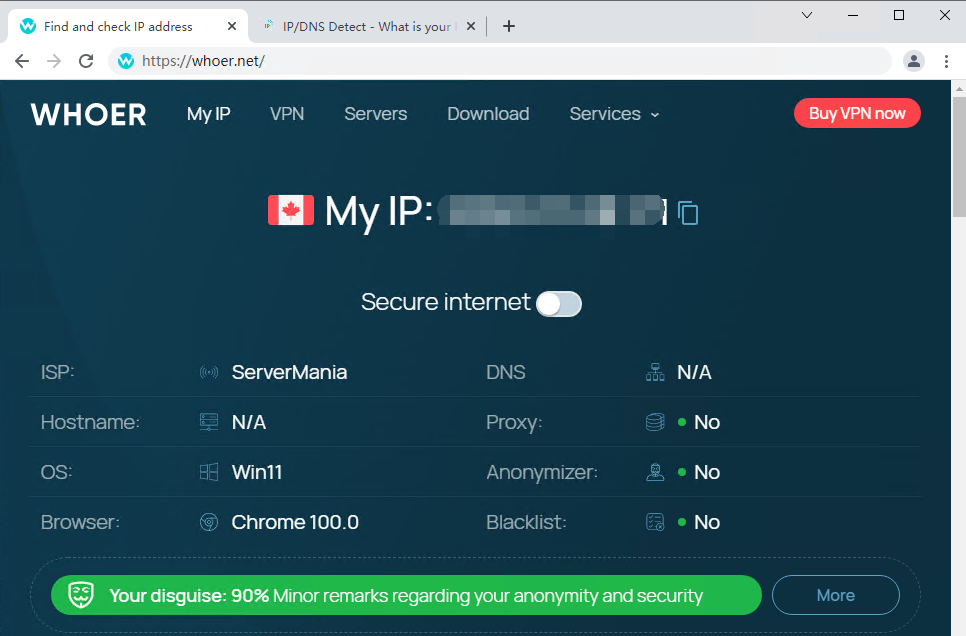

# proxy login automator

> 一个简易的代理转发工具，在本地部署lproxy，方便Puppeteer或Selenium使用身份验证的代理；也可以部署到您的服务器当作简易HTTP代理使用

> 访问流程：client browser > lproxy > external proxy > website

## 如何使用

- 首先启动代理服务

` dotnet lproxy.dll -p 6789 --proxy-server 192.168.120.150:8800:user:pwd`

<!-- 或者

`dotnet lproxy.dll --proxies /data/proxy.list` -->

```
-p              本地端口
--proxy-server  外部代理，格式：ip:port:user:pwd
```

我们来简单的试试

使用本地Chrome浏览器连接lproxy并访问whoer.net

`chrome.exe --proxy-server="127.0.0.1:6789" whoer.net`



Puppeteer

```c#
var browser = await Puppeteer.LaunchAsync(new LaunchOptions
{
    Args = new []{ "--proxy-server='127.0.0.1:6789" }
});

var page = await browser.NewPageAsync();
await page.SetRequestInterceptionAsync(true);
await page.GoToAsync("https://whoer.net/");
```

Selenium

```c#
var service = ChromeDriverService.CreateDefaultService();
var options = new ChromeOptions();
options.AddArguments("--proxy-server=127.0.0.1:6789");

IWebDriver webDriver = new ChromeDriver(service, options);
webDriver.Navigate().GoToUrl("https://whoer.net/");
```

Selenium也可以参考这个库 [
Selenium-Proxy-Authentication.Chrome](https://github.com/mahdibland/Selenium-Proxy-Authentication.Chrome)

## 其它功能

> lproxy运行时执行内部命令

```
list        显示lproxy所有本地端口和外部代理列表
clear       清空控制台日志
show        在控制台显示日志
hide        在控制台不显示日志
add         绑定新的外部代理（本地端口不能重复）
```
`add -p 本地端口 --proxy-server 外部代理IP:端口:用户名:密码`

`add -p 本地端口 --proxy-server 外部代理IP:端口`

#### Proxy Format

* ✅ Host:Port:Username:Password</br>
* ✅ Host:Port

## 用到的第三方库

- [titanium-web-proxy](https://github.com/justcoding121/titanium-web-proxy)